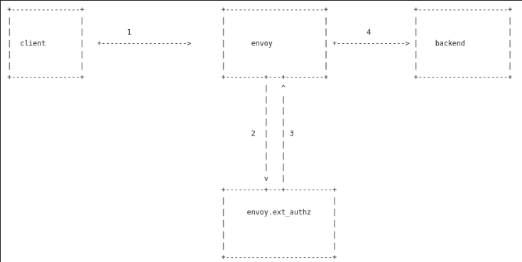

# Envoy External Authorization server (envoy.ext_authz) HelloWorld

I've been working with [Envoy Proxy](https://www.envoyproxy.io/) for sometime and covered a number of 'hello world' type of tutorials derived from my own desire to understanding it better (i tend to understand much more by actually rewriting in code and writing about; it helps reinforce).

Recently, wanted to understand and use the [external authorization server](https://www.envoyproxy.io/docs/envoy/latest/intro/arch_overview/security/ext_authz_filter#arch-overview-ext-authz) since i specialize in authn/authz quite a bit for my job. In digging into it earlier today, i found a number of amazing sample that this post is based on:

* [Open Policy Agent with Envoy](https://www.openpolicyagent.org/docs/latest/envoy-authorization/)
* _@Josh Barratt's_ awesome post about [Envoy + Custom Auth + Ratelimiter Example](https://serialized.net/2019/05/envoy-ratelimits/)
* _@Rick Lee's_ [Envoy External Authorization — A simple example](https://medium.com/@ricklee_10931/envoy-external-authorization-a-simple-example-d50ef2ede631)

But as with anything I do, I gotta try it out myself from scratch an reverse engineer...otherwise its it doesn't hold [object permanence](https://en.wikipedia.org/wiki/Object_permanence) for me.  This post is about how to get a basic "hello world" app using `envoy.ext_authz` where any authorization decision a envoy request makes is handled by an external gRPC service you would run.  You can pretty much offload each decision to let a request through based on some very specific rule you define.   You ofcourse do not have to use an external server for simple checks like JWT authentication based on claims or issuer (for that just use Envoy's built-in [JWT-Authentication](https://www.envoyproxy.io/docs/envoy/latest/configuration/http/http_filters/jwt_authn_filter#config-http-filters-jwt-authn)).  Use this if you run Envoy directly and wish to make a decision based on some other complex criteria not covered by the others.

This tutorial runs an an Envoy Proxy, a simple http backend and a gRPC service which envoy delegates the authorization check to.  You can take pertty much anyting out of the original inbound request context (headers, etc) to make a allow/deny decision on as well as append/alter headers)

Before we get started, a word from our sponsors ...here are some of the other references you maybe interested in

* [Simple Istio Mixer Out of Process Authorization Adapter](https://medium.com/google-cloud/simple-istio-mixer-out-of-process-authorization-adapter-5f9363cd9bbc)
* [Envoy RateLimit HelloWorld](https://github.com/salrashid123/envoy_ratelimit)
* [Envoy ControlPlane HelloWorld](https://github.com/salrashid123/envoy_control)
* [Envoy Discovery Service HelloWorld](https://github.com/salrashid123/envoy_discovery)
- [Envoy FluentD Parser](https://github.com/salrashid123/fluent-plugin-envoy-parser)


## Architecture

Well...its pretty straight forward as you'd expect

1. Client makes HTTP request
2. Envoy sends inbound request to an external Authorization server
3. External authorization server makes a decision given the request context
4. If authorized, the request is sent through

Steps 2,3 is encapsulated as a gRPC proto [external_auth.proto](https://github.com/envoyproxy/envoy/blob/master/api/envoy/service/auth/v2alpha/external_auth.proto) where the request response context is set:

```
// A generic interface for performing authorization check on incoming
// requests to a networked service.
service Authorization {
  // Performs authorization check based on the attributes associated with the
  // incoming request, and returns status `OK` or not `OK`.
  rpc Check(v2.CheckRequest) returns (v2.CheckResponse);
}
```

What that means is our gRPC external server needs to implement the `Check()` service..




## Setup

Anyway, lets get started.  You'll need:

- [Go 11+](https://golang.org/dl/)
- [Get Envoy](https://www.getenvoy.io/):   The tutorial runs envoy directly here but you can use the docker image as well. 


### Start Backend

The backend here is a simple http webserver that will print the inbound headers and add one in the response (```X-Custom-Header-From-Backend```).

```
$ go run backend_server/http_server.go 
```

### Start External Authorization server

```
$ go run authz_server/grpc_server.go
```


The core of the authorization server isn't really anything special...i've just hardcoded it to look for a header value of 'foo' through...you can add on any bit of complex handling here you want.

```golang
func (a *AuthorizationServer) Check(ctx context.Context, req *auth.CheckRequest) (*auth.CheckResponse, error) {
	log.Println(">>> Authorization called check()")
	authHeader, ok := req.Attributes.Request.Http.Headers["authorization"]
	var splitToken []string

	if ok {
		splitToken = strings.Split(authHeader, "Bearer ")
	}
	if len(splitToken) == 2 {
		token := splitToken[1]

		if token == "foo" {
			return &auth.CheckResponse{
				Status: &rpcstatus.Status{
					Code: int32(rpc.OK),
				},
				HttpResponse: &auth.CheckResponse_OkResponse{
					OkResponse: &auth.OkHttpResponse{
						Headers: []*core.HeaderValueOption{
							{
								Header: &core.HeaderValue{
									Key:   "x-custom-header-from-authz",
									Value: "some value",
								},
							},
						},
					},
				},
			}, nil
		} else {
			return &auth.CheckResponse{
				Status: &rpcstatus.Status{
					Code: int32(rpc.PERMISSION_DENIED),
				},
				HttpResponse: &auth.CheckResponse_DeniedResponse{
					DeniedResponse: &auth.DeniedHttpResponse{
						Status: &envoy_type.HttpStatus{
							Code: envoy_type.StatusCode_Unauthorized,
						},
						Body: "PERMISSION_DENIED",
					},
				},
			}, nil

		}

	}
	return &auth.CheckResponse{
		Status: &rpcstatus.Status{
			Code: int32(rpc.UNAUTHENTICATED),
		},
		HttpResponse: &auth.CheckResponse_DeniedResponse{
			DeniedResponse: &auth.DeniedHttpResponse{
				Status: &envoy_type.HttpStatus{
					Code: envoy_type.StatusCode_Unauthorized,
				},
				Body: "Authorization Header malformed or not provided",
			},
		},
	}, nil
}
```

### Start Envoy

```bash
$ envoy -c basic.yaml -l info
```

The envoy confg settings describe [ext-authz](https://www.envoyproxy.io/docs/envoy/latest/configuration/http/http_filters/ext_authz_filter#config-http-filters-ext-authz) as well as a set of custom headers to send to the client and the authorization checker (i'll discuss that bit later on in the doc)

```yaml
    filter_chains:
    - filters:
      - name: envoy.http_connection_manager
        typed_config:  
          "@type": type.googleapis.com/envoy.config.filter.network.http_connection_manager.v2.HttpConnectionManager
          stat_prefix: ingress_http
          codec_type: AUTO
          route_config:
            name: local_route
            virtual_hosts:
            - name: local_service
              domains: ["*"]
              routes:
              - match:
                  prefix: "/"
                route:
                  host_rewrite: server.domain.com
                  cluster: service_backend
                request_headers_to_add:
                  - header:
                      key: x-custom-to-backend
                      value: value-for-backend-from-envoy
                per_filter_config:
                  envoy.ext_authz:
                    check_settings:
                      context_extensions:
                        x-forwarded-host: original-host-as-context  				

          http_filters:
          - name: envoy.ext_authz
            config:
              grpc_service:
                envoy_grpc:
                  cluster_name: ext-authz
                timeout: 0.5s

  clusters:
  - name: ext-authz
    type: static
    http2_protocol_options: {}
    load_assignment:
      cluster_name: ext-authz
      endpoints:
      - lb_endpoints:
        - endpoint:
            address:
              socket_address:
                address: 127.0.0.1
                port_value: 50051                
```

The moment you start envoy, it will start sending gRPC healthcheck requests to the backend.  That bit isn't related to authorization services but i thouht it'd be nice to add into envoy's config.  For more info, see the part where the backend requests are made here in this the generic [grpc_health_proxy](https://github.com/salrashid123/grpc_health_proxy)


### Send Requests

1.  No Header

```bash
$ curl -vv -w "\n"  http://localhost:8080/

> GET / HTTP/1.1
> Host: localhost:8080
> User-Agent: curl/7.66.0
> Accept: */*
> 

< HTTP/1.1 401 Unauthorized
< content-length: 46
< content-type: text/plain
< date: Sat, 09 Nov 2019 17:22:39 GMT
< server: envoy
< 
Authorization Header malformed or not provided
```

### Send Incorrect Header

```bash
$ curl -vv -H "Authorization: Bearer bar" -w "\n"  http://localhost:8080/

> GET / HTTP/1.1
> Host: localhost:8080
> User-Agent: curl/7.66.0
> Accept: */*
> Authorization: Bearer bar

* Mark bundle as not supporting multiuse
< HTTP/1.1 401 Unauthorized
< content-length: 17
< content-type: text/plain
< date: Sat, 09 Nov 2019 17:25:14 GMT
< server: envoy
< 

PERMISSION_DENIED
```

### Send Correct Header

```bash
$ curl -vv -H "Authorization: Bearer foo" -w "\n"  http://localhost:8080/

> GET / HTTP/1.1
> Host: localhost:8080
> User-Agent: curl/7.66.0
> Accept: */*
> Authorization: Bearer foo

< HTTP/1.1 200 OK
< x-custom-header-from-backend: from backend
< date: Sat, 09 Nov 2019 17:26:06 GMT
< content-length: 2
< content-type: text/plain; charset=utf-8
< x-envoy-upstream-service-time: 0
< x-custom-header-from-lua: bar
< server: envoy

ok
```

### Send Custom Headers to ext_authz server

If you want to add a custom metadata/header to just the authorization server that was _not_ included in the original request (eg to address [envoy issue #3876]([https://github.com/envoyproxy/envoy/issues/3876#issuecomment-552173472),  consider using the [attribute_context extension](
https://www.envoyproxy.io/docs/envoy/latest/api-v2/service/auth/v2/attribute_context.proto#envoy-api-field-service-auth-v2-attributecontext-context-extensions)


In the  configuration above, if you send a request fom the with these headers

Client:

```
$ curl -vv -H "Authorization: Bearer foo" -H "Host: s2.domain.com" -H "foo: bar" http://localhost:8080/

	> GET / HTTP/1.1
	> Host: s2.domain.com
	> User-Agent: curl/7.66.0
	> Accept: */*
	> Authorization: Bearer foo
	> foo: bar
	> 
	* Mark bundle as not supporting multiuse
	< HTTP/1.1 200 OK
	< x-custom-header-from-backend: from backend
	< date: Mon, 11 Nov 2019 19:19:44 GMT
	< content-length: 2
	< content-type: text/plain; charset=utf-8
	< x-envoy-upstream-service-time: 0
	< x-custom-header-from-lua: bar	
	< server: envoy
	< 

	ok
```

External Authorization server will see an additional context value sent `"x-forwarded-host"` which you can use to make decision.

```
$ go run authz_server/grpc_server.go
	2019/11/11 11:19:39 Starting gRPC Server at :50051
	2019/11/11 11:19:42 Handling grpc Check request
	2019/11/11 11:19:44 >>> Authorization called check()
	2019/11/11 11:19:44 Inbound Headers: 
	2019/11/11 11:19:44 {
	":authority": "s2.domain.com",
	":method": "GET",
	":path": "/",
	"accept": "*/*",
	"authorization": "Bearer foo",
	"foo": "bar",
	"user-agent": "curl/7.66.0",
	"x-forwarded-proto": "http",
	"x-request-id": "86c79873-b145-4e82-8e7c-800ecb0ba931"
	}
	
	2019/11/11 11:19:44 Context Extensions: 
	2019/11/11 11:19:44 {
	"x-forwarded-host": "original-host-as-context"
	}
```

Finally, the backend system _will not_ see that custom header but all the others you specified

```
$ go run backend_server/http_server.go 
	2019/11/11 11:19:42 Starting Server..
	2019/11/11 11:19:44 / called
	GET / HTTP/1.1
	Host: server.domain.com
	Accept: */*
	Authorization: Bearer foo
	Content-Length: 0
	Foo: bar
	User-Agent: curl/7.66.0
	X-Custom-Header-From-Authz: some value
	X-Custom-To-Backend: value-for-backend-from-envoy
	X-Envoy-Expected-Rq-Timeout-Ms: 15000
	X-Forwarded-Proto: http
	X-Request-Id: 86c79873-b145-4e82-8e7c-800ecb0ba931
```

---

Thats it...but realistically, you probably would be fine with using Envoy's built-in capabilities or with [Open Policy Agent](https://www.openpolicyagent.org/docs/latest/envoy-authorization/) or even [Istio Authorization](https://istio.io/docs/tasks/security/authz-http/).  This repo is just a demo of stand-alone Envoy.


---


### References

#### Google Issued OpenID Connect tokens

- [Envoy JWT Authentication](https://www.envoyproxy.io/docs/envoy/latest/configuration/http/http_filters/jwt_authn_filter#config-http-filters-jwt-authn)
- [Authenticating using Google OpenID Connect Tokens](https://github.com/salrashid123/google_id_token)
- [gRPC Authentication with Google OpenID Connect tokens](https://github.com/salrashid123/grpc_google_id_tokens)
- SO/git Issues
  - [Ext_authz and lua filters in one filter chain](https://github.com/envoyproxy/envoy/issues/8250)
  - [Envoy ext_authz filter before lua](https://stackoverflow.com/questions/57954604/envoy-ext-authz-filter-before-lua)
